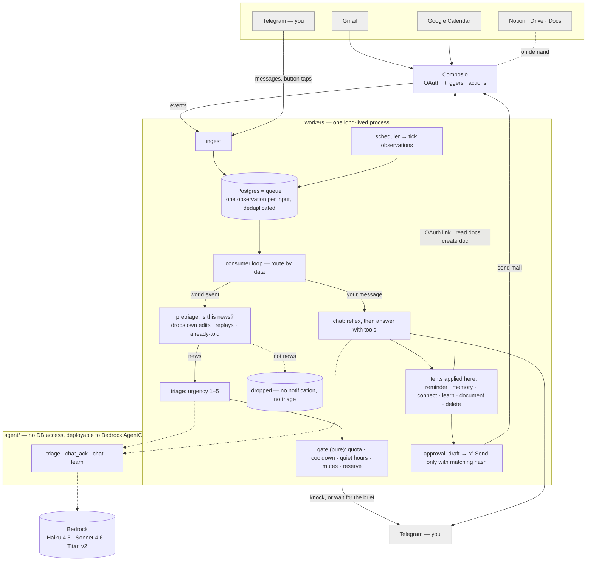

# Architecture

Peyk is built on one idea: **observe everything, interrupt rarely, act only with approval.**

Every input — a mail, a calendar event, a Telegram message, a scheduler tick — becomes one `observation` row in
Postgres. One consumer loop works through that queue. A model decides *how important* something is; a
deterministic function decides *whether it is worth interrupting you*. Every outgoing mail is a draft you approve
in chat, and the approval carries a hash of exactly what you saw.

## The picture



## Life of an observation

1. **Ingest.** Each adapter is an `async for` over its source: Composio's realtime socket (or the webhook gateway),
   Telegram's `getUpdates`. Every item is inserted as an `observation` with a natural key
   (`user_id, source, source_key`); duplicates are dropped by the database, so replays and backfills are safe.
   A Telegram voice note is turned into text right here (Mistral Voxtral on Bedrock by default, OGG/Opus decoded
   to MP3 in memory; Amazon Transcribe streaming as the other engine, language identified among the person's
   client language and `STT_LANGUAGES`): the observation carries the bracketed transcript in `payload.control`,
   so no worker knows it was spoken. A failed transcription still reaches the agent as a note it can relay.
   A photo or screenshot takes the same road (`core/vision.py`): the largest size is downloaded and a vision model
   (the chat model, via Bedrock Converse) writes a description for an assistant that cannot see it — every readable
   text verbatim, what it most likely is — which follows the person's caption in `payload.control` as
   `[photo, automatic description] …`. When the person taps *reply* on a message, the quoted text travels as
   `ControlEvent.reply_to` (a bracketed line the agent reads before their words), kept apart from `text` so command
   parsing and draft edits see the person's words only.
2. **Claim.** The consumer loop claims the next `new` observation with `FOR UPDATE SKIP LOCKED`. A claim older than
   5 minutes is recovered by the maintenance loop; after 5 attempts an observation is marked `failed`.
3. **Route by data.** Observations from a person's own control channel (Telegram, later WhatsApp) are commands,
   button taps or chat. Everything else is a world event. There is no `if source == "gmail"` in the workers.
4. **World events: is it news, then triage, then gate.** First `workers/pretriage.py` drops what is not news:
   a calendar change the person made themselves (or Peyk made for them), a replay, an edit nobody needs, or a change
   they were told about minutes ago through the other channel (Google's own mail and the calendar trigger carry the
   same news; whichever comes second stays quiet). A calendar change that is news gets `change` (invited, moved,
   changed, cancelled, guest_answered), found by comparing with the event's previous state. The agent's `triage` task returns urgency 1–5, a category, a reason and a
   one-line summary in the person's language. The gate (`workers/gate.py`) then decides whether to notify — see
   [Interruption budget](#interruption-budget). A notification is sent with 👍 useful · 👎 noise · 🔇 mute buttons
   and recorded in `sent_notification`, so the chat later knows what "that mail" refers to.
5. **Control channel.** `/remind` is the only command. Button taps go to feedback, approval or account deletion.
   Plain text is chat.
6. **Chat.** Messages a person sends within 2.5 s are merged into one turn. The worker builds the context the agent
   needs (last 10 turns, last 48 h of observations, memory hits, connected services, pending proposals) and calls
   the agent in two stages: a fast reflex from the Haiku-class model ("Sure, checking today's mail…" — or the
   answer itself if it is trivial), then the full Sonnet-class agent with tools. The agent returns a reply and
   *intents*; the worker applies the side effects. If the agent asks for more data (`NeedMore`) or needs another
   document round, the worker fetches and calls again (up to 2 rounds, 4 for documents).
7. **Ticks.** The scheduler turns due jobs into `tick` observations every 30 s. They go through the same queue and
   are dispatched by job kind — morning brief, reminder, reconcile, connection polling, first-learn.

## The agent package

`agent/` is the only code that could run on Bedrock AgentCore Runtime. It has no database access and imports
nothing from `core/` or `workers/`: everything it needs arrives in the payload, and it answers with plain JSON.
Two tests enforce this (`tests/phase1/test_agent_contract.py`, `tests/phase3/test_chat.py`). The workers call it
through `agent/client.py` with `AGENT_MODE=local` (in-process) or `AGENT_MODE=agentcore` (`invoke_agent_runtime`).

| Task | Model | Input | Output |
|---|---|---|---|
| `triage` | Haiku 4.5, structured output | one observation + what is known about the sender | `TriageResult`: urgency, category, reason, summary |
| `chat_ack` | Haiku 4.5 | message + history | `needs_work` and the first reflex to send right away |
| `chat` | Sonnet 4.6 + tools | message, history, recent observations, memory hits, user + connection state | `reply` + list of intents |
| `learn` | Sonnet 4.6, structured output | a metadata sample of a freshly connected service | 3–6 facts, a profile suggestion, top people, a message asking for confirmation |

Chat tools and the intents they produce:

| Tool | What it does | Intent applied by the worker |
|---|---|---|
| `search_observations`, `search_memory` | look through the data already in the payload | — |
| `need_more` | ask for more observations matching a query | `NeedMore` → another round |
| `find_contact` | resolve a name to an address (identity table, then Composio contacts) | handled in the round loop |
| `remember` | store a durable fact | `MemoryWrite` → pgvector |
| `schedule_followup` | set a reminder (the prompt makes it propose a time first) | `ScheduleRequest` → `scheduled_job` |
| `draft_reply` | prepare a mail | `ActionDraft` → approval flow |
| `connect_service` | offer a Gmail / Calendar / Notion / Drive / Docs connection | `ConnectRequest` → OAuth link |
| `set_profile`, `confirm_learned` | save what the person told or confirmed | `ProfileUpdate`, `LearnConfirm` |
| `search_documents`, `read_document` | find and read Notion pages, Drive files, Google Docs | — |
| `create_document` | create a page or doc in the person's own workspace | `DocumentCreate` → created immediately, link sent |
| `find_events`, `find_free_time` | read the person's Google Calendar: a window's events, free and busy time, told on the clock of where the person is now (set_profile moves it within the turn) | `CalendarQuery` → resolved in the round loop |
| `create_event`, `update_event`, `cancel_event`, `respond_to_invite` | write to the primary calendar | `CalendarWrite` → a private event is written at once, link sent; anything that notifies other people becomes an approval card |
| `web_search`, `open_web_page` | the public web (DuckDuckGo, no key; Tavily optional) and a page's text, for questions about the world | `WebQuery` → resolved in the round loop, never persisted |
| `delete_my_data` | start account deletion | `DeleteAccountRequest` → two confirmations |

System events (a service connected, a link expired, the morning brief) are also voiced by the chat agent in an
"event mode" without tools, with a template as fallback if the model fails.

## People, onboarding, learning

- **One row per person** in `app_user`, identified by the control channel (`telegram` + chat id). Their Composio
  user id is Peyk's own uuid, so trigger payloads map back to the right person. The single-user values in `.env`
  are migrated into this table once at start-up.
- **Onboarding is a conversation.** A new person says hi; the agent introduces itself, asks who they are, and
  offers to connect a service. `ConnectRequest` creates a Composio OAuth link and an `await_connection` job that
  polls every 20 s for up to 15 minutes; once the account is active, the toolkit's triggers are created and a
  `first_learn` job is scheduled.
- **First-learn, with consent.** The worker samples the last 30 days of *metadata* (senders, subjects, document
  titles — never bodies), registers the people it saw, and the `learn` task proposes facts and a profile. Nothing
  is stored until the person confirms in chat (`confirm_learned`). Sensitive situations are only asked about.
- **Connected services** are re-read from Composio at most every 5 minutes; the agent answers "what is connected?"
  from that list only.
- **Deletion** asks twice (buttons, 10-minute expiry), revokes the Composio connections, then deletes every row
  keyed by the user.

## Interruption budget

`workers/gate.py` is a pure function: no I/O, no model. The model has already said how important something is;
this decides whether it is worth interrupting. First matching rule wins:

| Rule | Result |
|---|---|
| sender, thread or category muted | no |
| it happened more than 3 h ago (found late: an outage, a replay) | no — the brief tells it with its age, whatever the urgency |
| urgency ≥ 5 (bypass) | yes, unless the daily quota is fully used — bypass pierces cooldown and quiet hours, never the quota |
| quiet hours | no |
| urgency ≤ 2 | no |
| same thread notified within the cooldown (default 4 h) | no |
| ordinary slots used (`daily_quota − bypass_reserve`, default 10 − 2) | no |
| otherwise | yes |

The reserve exists because a replay of labelled mail showed a busy morning of urgency-3/4 pings starving an
afternoon emergency. A notification the person marks 👎 noise gives its slot back. What the person says is urgent
for them goes into their profile, and triage rates such events 5. Everything that did not knock lands in the 08:00
brief, and the reason it did not knock is stored with the triage (`triage.gate_reason`), so the chat can say why.

## Approval

```
draft ──present──▶ awaiting_approval ──approve(hash)──▶ approved ──send──▶ sent
                        │  ▲                              │
                        │  └── edit(new content) ─────────┘   (hash changes → awaiting_approval again)
                        └── reject ──▶ rejected
```

The Telegram buttons carry the first 16 hex characters of the content hash. Editing a draft changes the hash, so
the Send button of an older message is refused with "draft changed, approve again". `send()` is idempotent.
Documents created in the person's own workspace (Notion page, Google Doc) skip this machine: they reach nobody
else, so they are created immediately and the link is sent.

## Scheduled jobs

| Kind | Created by | What the tick does |
|---|---|---|
| `morning_brief` | default job, `MORNING_BRIEF_AT` local time | collects urgency ≥ 3 of the last 24 h; the agent writes the brief, a template is the fallback |
| `followup` | `/remind`, `schedule_followup` | sends the reminder |
| `reconcile` | default job, every `RECONCILE_EVERY` | backfills each source since cursor − 15 min; missed trigger events surface as fresh observations, seen ones are no-ops |
| `recheck_thread` | nothing yet (handler and test exist for a later "check this thread again" feature) | re-triages the latest message of a thread |
| `await_connection` | onboarding | polls the OAuth connection, enables triggers, schedules `first_learn` |
| `first_learn` | connection success | samples metadata and asks the `learn` task; runs detached so it never stalls other users |

## Data model

Migrations in `db/migrations/`, plain SQL, applied on container start.

| Table | Purpose |
|---|---|
| `observation` | every input; also the queue (`status`, `claimed_at`, `attempts`) |
| `triage`, `sent_notification`, `mute_rule`, `budget_settings` | triage result per observation, what was sent, mutes, per-user budget |
| `scheduled_job` | one-off and recurring jobs (`daily@08:00`, `every:10m`) |
| `memory` | confirmed facts with Titan v2 embeddings (1024 dims, HNSW cosine index) |
| `action` | drafts and their state, content hash, approved hash |
| `app_user`, `identity`, `person`, `source_cursor`, `chat_state` | people, their addresses, backfill cursors, chat bookkeeping |

## Decisions that shaped the code

| Decision | Why | Where |
|---|---|---|
| Postgres is the queue | one system, `FOR UPDATE SKIP LOCKED`, crash recovery is an `UPDATE` | `core/queue.py`, `workers/maintenance.py` |
| Dedup in the DB, not in adapters | `unique (user_id, source, source_key)`; websocket, webhook, backfill and reconcile are all safe to replay | `db/migrations/0001_core.sql` |
| Importance and interruption are different questions | the model rates urgency; a pure function with a budget decides whether to ping | `agent/triage_agent.py`, `workers/gate.py` |
| Budget keeps a reserve for urgency 5 | replay showed morning 3/4s starving an afternoon emergency | `bypass_reserve` in `workers/gate.py` |
| Scheduler emits ticks, does no work | one consumer loop, one failure model; reminders, briefs and reconcile are just observations | `workers/scheduler.py`, `workers/ticks.py` |
| Reconcile every 10 min | Composio triggers are polling + push without replay; a disabled trigger loses events (measured) | `workers/ticks.py` |
| Agent never touches the DB | required for AgentCore isolation; tools return data or intents, workers apply side effects | `agent/`, two tests |
| Approval carries the content hash | an old Telegram button can never send an edited draft | `workers/actions.py` |
| Adding a source is a data change | Calendar was one mapping row; a test checks that the diff between tags touched no core file | `adapters/composio/mappings.py`, `tests/phase5/` |
| Two-stage chat reply | a secretary answers at once and then comes back with facts; the reflex may not commit to decisions | `workers/chat.py`, `agent/chat_agent.py` |
| Onboarding through intents, not commands | anyone can message the bot; the control channel is an adapter so WhatsApp can follow | `workers/onboarding.py`, `core/routing.py` |
| Learn from metadata, store after consent | privacy by construction: bodies are never sampled, facts are proposals until confirmed | `adapters/composio/profile.py`, `workers/learn.py` |
| Profile comes from the payload only | in a multi-user process an env fallback would leak one person's profile to another | `agent/model.py` |

## Processes

| Process | Runs | Talks to |
|---|---|---|
| `workers` | asyncio tasks in one container: ingest per adapter, scheduler, consumer loop, maintenance, `/health` on 8080 | Postgres, Telegram, Composio, Bedrock (or AgentCore) |
| `gateway` | FastAPI, only needed with `COMPOSIO_DELIVERY=webhook` | Postgres (insert only) |
| `agent` | in-process by default; `agentcore deploy` puts it on AgentCore Runtime (CodeZip) | Bedrock only |
| `sessions` | placeholder for stateful adapters (WhatsApp), out of scope for now | — |

`/health` answers 200 only when the database responds and every loop has reported a heartbeat in the last
5 minutes; Fly restarts the machine otherwise.

## Where to look

| You want to… | Start here |
|---|---|
| add a source | `adapters/composio/mappings.py` (trigger → observation), `adapters/composio/setup.py` (toolkit + triggers) |
| change what counts as urgent | `agent/triage_agent.py` |
| change when Peyk knocks | `workers/gate.py`, `core/repo/budget_repo.py` |
| change how it talks | `agent/chat_agent.py` (prompt, tools), `workers/chat.py` (context, rounds, side effects) |
| add a chat capability | a tool in `agent/chat_agent.py` that appends an intent, and its handler in `workers/chat.py::apply_intents` |
| change the Telegram shape | `adapters/telegram/adapter.py`, `core/routing.py` |
| add a scheduled job | a handler in `workers/ticks.py::HANDLERS` |
| add a table | a new file in `db/migrations/`, a repo module in `core/repo/` |
